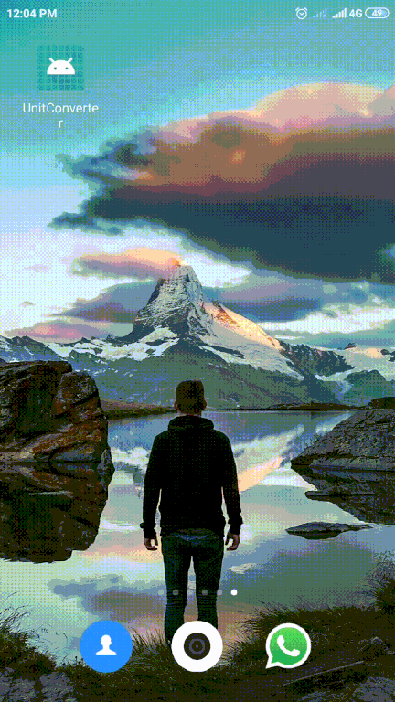

# Unit-converter reactnative project

## Additional packages used

```
npm i react-native-gesture-handler
npm i react-native-safe-area-context
npm i @react-navigation/native
npm i @react-navigation/stack
npm i react-native-screens
npm i @react-native-community/masked-view
npm i victory-native
npm i react-native-svg
```

## Demo


